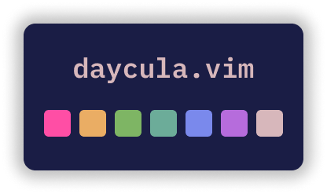
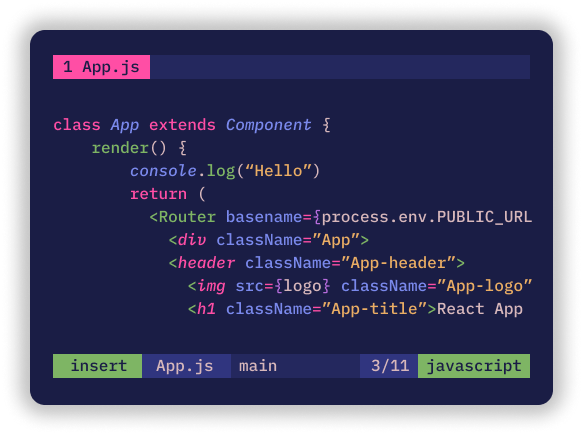

<p align='center'></p>

## About

A dark, vivid and calming colorscheme for Vim, with ports for other code editor and terminal coming soon

This colorscheme works best with [vim-polyglot](https://github.com/sheerun/vim-polyglot), please install it first

Make sure your terminal supports true colors as for now this colorscheme only supports that

## Screenshot

<p align='center'></p>

## Features

- Numerous filetypes and plugins support
- Many customization option
- Support for <i>italic</i> fonts

## Installation

Here i'm using vim-plug

```vim
Plug 'ghifarit53/daycula-vim'
```

after installed, add this to your `vimrc` or `init.vim`

```vim
set termguicolors

colorscheme daycula
```

## Statusline

Daycula supports lightline.vim and airline.vim plugins. See below configuration to make those plugin use daycula

#### Lightline

```vim
let g:lightline = { 'colorscheme' : 'daycula'}
```

#### Airline

```vim
let g:airline_theme = "tokyonight"
```

## Customization


